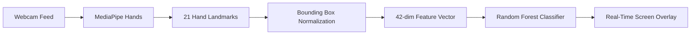

# Sign Language Recognition

Real-time sign language alphabet recognition using MediaPipe hand landmarks and a scikit-learn classifier, in Python.

[](https://www.python.org/)
[](LICENSE)
[](https://opencv.org/)
[](https://google.github.io/mediapipe/)
[](https://scikit-learn.org/)

---

## Overview

This project provides a lightweight, real-time sign language alphabet recognition system capable of identifying 26 static hand gestures (A–Z). Designed to improve accessibility communication, the pipeline extracts 21 key hand landmark coordinates per frame using Google's MediaPipe Hands and classifies them with a Random Forest model.

Unlike traditional Convolutional Neural Networks (CNNs) that process raw RGB pixels, this landmark-based approach relies on 42 spatial coordinates. This makes the system computationally efficient, enabling real-time CPU inference without requiring GPU acceleration.

---

## Demo


<!-- TODO: Add a screen recording GIF of realtime inference to assets/demo.gif -->

---

## Features

- **Automated Data Collection**: Webcam utility to capture dataset samples across 26 gesture categories.
- **Landmark Extraction & Normalization**: Extracts 21 2D hand joint coordinates relative to bounding box origins.
- **Efficient ML Classifier**: Trains a Random Forest classifier using scikit-learn.
- **Real-Time Webcam Overlay**: Draws hand skeletons, bounding boxes, and predicted letter overlays on live video feeds.

---

## How It Works



### Landmark Normalization & Translation Invariance
MediaPipe extracts 21 3D coordinates \((x_i, y_i, z_i)\). To make classification invariant to hand position within the webcam frame, coordinates are normalized relative to the minimum coordinate values of the detected hand bounding box:

\[
x_{\text{normalized}} = x_i - \min(\mathbf{x}), \quad y_{\text{normalized}} = y_i - \min(\mathbf{y})
\]

This yields a 42-dimensional feature vector (\(21 \times 2\)) invariant to global translation.

---

## Tech Stack

| Library / Tool | Role |
| :--- | :--- |
| **Python** | Primary programming language (Python 3.8 – 3.11 supported) |
| **MediaPipe** | 21 hand landmark detection & spatial coordinate extraction |
| **OpenCV** | Webcam video capture, image processing, and real-time visualization |
| **scikit-learn** | Random Forest classification model training & accuracy scoring |
| **NumPy** | Array manipulations for landmark vectors |

---

## Project Structure

```
Sign-Language/
├── src/
│   ├── 01_collect_images.py      # Script 1: Capture dataset images via webcam
│   ├── 02_create_dataset.py      # Script 2: Extract MediaPipe landmarks to data.pickle
│   ├── 03_train_model.py         # Script 3: Train Random Forest classifier -> models/model.p
│   └── 04_realtime_inference.py  # Script 4: Live webcam sign recognition & overlay
├── models/
│   └── model.p                   # Pre-trained Random Forest model file (~3.1 MB)
├── data/                         # Local dataset directory (git-ignored)
│   └── .gitkeep
├── assets/                       # Demo GIFs & documentation media
│   └── .gitkeep
├── requirements.txt              # Pinned Python package dependencies
├── .gitignore                    # Git ignore rules for artifacts & caches
├── LICENSE                       # MIT License
└── README.md                     # Project documentation
```

---

## Getting Started

### Prerequisites

- **Python Version**: Python 3.8 to 3.11 recommended (MediaPipe release compatibility).
- **Hardware**: Working webcam connected to your system.

### Installation

#### macOS / Linux

```bash
# Clone the repository
git clone https://github.com/MohdAsad2903/Sign-Language.git
cd Sign-Language

# Create and activate virtual environment
python3 -m venv .venv
source .venv/bin/activate

# Install dependencies
pip install --upgrade pip
pip install -r requirements.txt
```

#### Windows (PowerShell)

```powershell
# Clone the repository
git clone https://github.com/MohdAsad2903/Sign-Language.git
cd Sign-Language

# Create and activate virtual environment
python -m venv .venv
.\.venv\Scripts\Activate.ps1

# Install dependencies
python -m pip install --upgrade pip
pip install -r requirements.txt
```

---

## Usage

> **Note**: You can run real-time inference immediately using the pre-trained model stored in `models/model.p`! Steps 1–3 are only required if you wish to collect custom images and retrain the model.

### Quick Start: Real-Time Inference

Run the inference script to open the webcam window:

```bash
python src/04_realtime_inference.py
```
- Press **`Q`** while focused on the video window to quit.

---

### Retraining Pipeline (Steps 1–3)

#### Step 1: Collect Image Data
Captures 100 images for each of the 26 alphabet classes (0–25):

```bash
python src/01_collect_images.py
```
- Press **`Q`** when ready to start capturing each class.

#### Step 2: Create Landmark Dataset
Processes images in `data/` with MediaPipe Hands and generates `data/data.pickle`:

```bash
python src/02_create_dataset.py
```

#### Step 3: Train Classifier
Trains the Random Forest model on `data/data.pickle` and saves the output to `models/model.p`:

```bash
python src/03_train_model.py
```

---

## Dataset

- **Classes**: 26 categories representing ASL alphabet letters (`0` to `25` mapped to `A` through `Z`).
- **Samples per Class**: 100 images per class (2,600 images total).
- **Format**: Raw RGB images captured locally under `data/<class_id>/` (git-ignored as regenerable artifacts).

---

## Model & Evaluation

- **Algorithm**: `RandomForestClassifier` (scikit-learn defaults).
- **Feature Vector**: 42 numeric values per hand (\(21 \times 2\) normalized landmark coordinates).
- **Serialization**: Saved as a Python pickle dictionary `{'model': model}` at `models/model.p`.
- **Accuracy**: Run `python src/03_train_model.py` to evaluate accuracy on your dataset split.

---

## Limitations

- **Static Gestures Only**: Designed for single-frame static hand signs. Dynamic signs requiring motion (e.g., ASL letters 'J' and 'Z') are not currently supported.
- **Lighting & Background Sensitivity**: Extreme low-light conditions or skin-tone-colored backgrounds may affect MediaPipe hand detection.
- **Single Hand Focus**: Optimized for single-hand alphabet signs.
- **Subject Diversity**: Pre-trained model accuracy depends on training subject hand traits; retraining on multiple hands improves generalizability.

---

## Roadmap

- [ ] Dynamic gesture recognition (J, Z) using sequential models (LSTM / GRU).
- [ ] Word and sentence assembly buffer from predicted character streams.
- [ ] Text-to-Speech (TTS) audio synthesis output.
- [ ] Web application interface using Streamlit or FastAPI + React.
- [ ] Expanded multi-user training dataset.

---

## Contributing

Contributions are welcome! Please open an issue or submit a pull request for any bug fixes, improvements, or feature proposals.

1. Fork the repository
2. Create your feature branch (`git checkout -b feature/AmazingFeature`)
3. Commit your changes (`git commit -m 'feat: Add some AmazingFeature'`)
4. Push to the branch (`git push origin feature/AmazingFeature`)
5. Open a Pull Request

---

## License

Distributed under the MIT License. See [`LICENSE`](LICENSE) for more information.

---

## Author

**Mohd Asad**
- GitHub: [@MohdAsad2903](https://github.com/MohdAsad2903)
<!-- TODO: Add LinkedIn profile link -->
<!-- TODO: Add contact email -->

---

## Acknowledgements

- [Google MediaPipe Hands](https://google.github.io/mediapipe/solutions/hands.html)
- [OpenCV Community](https://opencv.org/)
- [scikit-learn Machine Learning Library](https://scikit-learn.org/)
